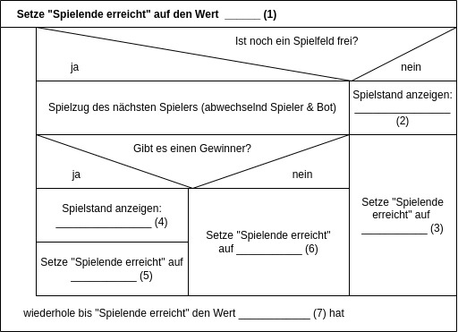
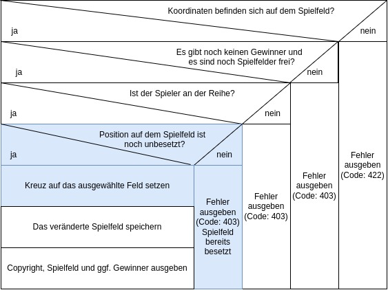

# Testaufgabe Junior Software Engineer Anwendungsentwicklung
Diese Testaufgabe gilt es zu lösen, wenn Du einen Stelle bei der [AV-TEST GmbH](https://av-test.org) als Software Engineer ergattern willst. 👾 🤖 😎

## Tic-Tac-Toe
[Tic-Tac-Toe](https://de.wikipedia.org/wiki/Tic-Tac-Toe) oder Drei gewinnt, ist ein einfaches Zweipersonen-Strategiespiel, das Du bestimmt schon selber gespielt hast.

## Spielablauf
Das Spielfeld besteht aus neun Feldern, die quadratisch (3 x 3) angeordnet sind.  
Die Spieler markieren abwechselnd eines der noch freien Felder mit einem Kreuz (:x:) bzw. Kringel (:o:).

Gewonnen hat, wer drei :x: bzw. :o: in einer Zeile, Spalte oder Diagonale – auch Mühle genannt – gekennzeichnet hat. Sind alle Felder belegt und keiner der Spieler hat gewonnen, so endet das Spiel unentschieden.

### Beispiel: X hat gewonnen

### Beispiel: Unentschieden

# Deine Aufgaben

## 1.) Vervollständige das Struktorgramm
Ein Nassi-Shneiderman-Diagramm oder auch **Struktogramm** ist ein Diagrammtyp zur Darstellung von Programmentwürfen im Rahmen der Methode der strukturierten Programmierung.  
Ein Struktogramm besteht immer aus den nachfolgenden Strukturblöcken, die ineinander geschachtelt oder miteinander kombiniert werden können:
### Anweisung
  
Jede Anweisung (Befehlsfolge), die das Programm abarbeiten soll, wird in einen rechteckigen Strukturblock geschrieben.
### Fallunterscheidung
  
Wenn die Bedingung zutreffend (wahr) ist, wird der Anweisungsblock 1 durchlaufen.
Trifft die Bedingung nicht zu (falsch), wird der Anweisungsblock 2 durchlaufen (if then else). Ein Anweisungsblock kann aus einer oder mehreren Anweisungen bestehen.
### Schleife mit Ausgangsbedingung
  
Die Bedingung, ob Anwendungsblock 1 erneut wiederholt werden soll, wird erst nach dem Durchlauf (dem Ausführen von Anwendungsblock 1) geprüft. Daraus ergibt sich, dass Anwendungsblock 1 mindestens einmal durchlaufen werden muss.

### Struktogramm Tic-Tac-Toe vervollständigen
Wir haben begonnen ein Struktogramm für das Spiel Tic-Tac-Toe zu erstellen.  
An einigen Stellen `(1), (2), (3), (4), (5), (6), (7)` sind wir uns nicht sicher. **Kannst Du uns helfen?**

*Bitte notiere Deine Lösungen und füge diese bei Fertigstellung in Deine E-Mail an uns ein.*

## 2.) Programmierung vorbereiten
Nachdem Du jetzt weißt, wie Tic-Tac-Toe funktioniert, wollen wir zusammen programmieren.  
Keine Sorge, wenn Du bislang nur wenig oder gar nicht programmiert hast, wir steigern uns langsam 😉  
Wir wollen Deinen Quellcode sehen können und mit Dir an Deinem Quellcode arbeiten können, daher verwenden wir, um den Quellcode kostenfrei auszutauschen, die Plattform GitHub.

### Bitte erledige die folgenden Schritte
- [ ] Du [verfügst bereits über einen GitHub-Account](https://github.com/login) **oder** [Du erstellst Dir einen kostenfreien GitHub-Account](https://github.com/join).
- [ ] Nachdem Du Dich bei Github.com angemeldet hast:
- [ ] Kopiere unseren Quellcode in Deinen GitHub-Account. Dazu musst Du nur den [folgenden Link klicken](https://github.com/avtestorg/Testaufgabe-Junior/generate).
    - **Bitte stelle die Sichtbarkeit des neue Repositories - wie voreingestellt - auf `Public`.**
- [ ] Im neu erstellten GitHub-Repository scrollst Du herunter, bis Du diese Anleitung siehst.
- [ ] Du machst nun an dieser Stelle aus Deinem soeben erstellten Repository weiter.
- [ ] Klone das Repository auf deinen Rechner und nutze einen Editor deiner Wahl, um den Code zu bearbeiten

## 3.) Copyright anpassen
Deine Tic-Tac-Toe Webanwendung besteht aus einem Frontend und einem Backend.  
Als Frontend verwenden wir das Tool `Swagger` mit dem man Schnittstellen mit einer grafischen Oberfläche einfach ausprobieren kann.  
Swagger kannst du nach Starten der Anwendung unter [http://localhost:8080/swagger-ui/index.html](http://localhost:8080/swagger-ui/index.html) öffnen.  
Als Backend verwenden wir eine Java Anwendung auf Basis des Frameworks [Spring Boot](https://spring.io/projects/spring-boot).

Wir haben eine Funktion vorbereitet, die das Copyright des Spiels ausgibt. ©️

**Bitte probiere die API-Methode zur Anzeige des Copyrights in Swagger aus:**
- [ ] Klicke in Swagger dazu auf `/copyright`.
- [ ] Klicke auf den Button `Try it out`.
- [ ] Sende die Anfrage, indem Du auf `Execute` drückst.
- Du siehst im Abschnitt `Response body` die Antwort mit dem aktuellen Copyright.

✍🏼 **Verändere das Copyright:**
- [ ] Öffne die Datei [src/main/java/de/avtest/testaufgabe/juniortask/rest/CopyrightController.java](src/main/java/de/avtest/testaufgabe/juniortask/rest/CopyrightController.java).
- [ ] In Zeile `17` wird das Copyright als String gespeichert.
- [ ] Benutze einen ASCII Generator um Dein persönliches Copyright zu erstellen.
- [ ] Ersetze das Copyright `By AVTEST` durch Dein eigenes Copyright.
- [ ] Probier Dein neues Copyright mit Swagger aus!
- [ ] Du musst Deine Änderung nun noch committen.

## 4.) Methode /play schreiben
Noch kannst Du nicht gegen den vom AV-TEST-Team programmierten Bot spielen.  
Es fehlt noch die Logik, was bei einem Aufruf der `/play`-API-Route passieren soll.

### Ein neues Spiel erstellen
Um ein neues Spiel zu erstellen, rufe in Swagger die Methode `/create` auf. Diese gibt dir eine ID zurück, die du für 
alle zukünftigen Requests benutzen kannst. 

Achtung: Wenn du den Server neustartest, sind alle Spiele verloren und du musst ein neues Spiel erstellen.

### Struktogramm für einen Spielzug
Anbei das Struktogramm für einen Spielzug von Dir mit der Methode `play()`.

**To-do:**
- [ ] Schau Dir in Ruhe das Struktogramm für einen Spielzug von Dir an!
    - Die von Dir noch zu implementierenden Teile des Spielzugs haben wir im Struktogramm farblich hervorgehoben.
- [ ] In der Datei [src/main/java/de/avtest/testaufgabe/juniortask/rest/GameController.java](src/main/java/de/avtest/testaufgabe/juniortask/rest/GameController.java) in der Methode `play()` - Zeile 185 fehlt noch die Logik.
    - Bitte ergänze die fehlende Logik, wir haben Dir Hilfestellungen in Form von Kommentaren im Quelltext hinterlassen.
- [ ] Teste Deinen Spielzug in Swagger, die Funktion heißt dort ebenfalls `/play`.
- [ ] ✅ Erstelle einen Commit
- [ ] 🔁 Push deine Commits um Deine Änderungen auf GitHub hochzuladen.

## 5.) Der 🤖 spielt - /play-bot
Wir haben bereits einen 🤖 (Bot) geschrieben, gegen den Du spielen kannst.  
Öffne dazu Swagger und verwende im Wechsel (Du beginnst) die `/play`-API-Route und die `/play-bot`-API-Route.

## 6.) Cheaten verboten - <kbd>↑</kbd><kbd>↑</kbd><kbd>↓</kbd><kbd>↓</kbd><kbd>←</kbd><kbd>→</kbd><kbd>←</kbd><kbd>→</kbd><kbd>B</kbd><kbd>A</kbd>
Aktuell kannst Du oder der Bot noch mehrmals hintereinander spielen, obwohl ihr nicht an der Reihe seit.  
So macht das natürlich keinen Spaß 😞!

**To-do:**
- [ ] In der Datei [src/main/java/de/avtest/testaufgabe/juniortask/rest/GameController.java](src/main/java/de/avtest/testaufgabe/juniortask/rest/GameController.java) in der Methode `isAllowedToPlay()` - Zeile 142 fehlt noch die Logik.
    - Bitte ergänze die fehlende Logik, wir haben Dir Hilfestellungen in Form von Kommentaren im Quelltext hinterlassen.
- [ ] Teste deine Änderung in Swagger ausführlich
- [ ] ✅ Erstelle einen Commit
- [ ] 🔁 Push deine Commits um Deine Änderungen auf GitHub hochzuladen.

## 7.) Wer hat gewonnen? 🏆
Aktuell kann das Spiel noch keinen Gewinner ausgeben.  
Es ist an Dir das zu ändern.

**To-do:**
- [ ] In der Datei [src/main/java/de/avtest/testaufgabe/juniortask/rest/GameController.java](src/main/java/de/avtest/testaufgabe/juniortask/rest/GameController.java) in der Methode `whoHasWon()` - Zeile 125 fehlt noch die Logik.
    - Bitte ergänze die fehlende Logik, wir haben Dir Hilfestellungen in Form von Kommentaren im Quelltext hinterlassen.
- [ ] Teste deine Änderung in Swagger ausführlich
- [ ] ✅ Erstelle einen Commit
- [ ] 🔁 Push deine Commits um Deine Änderungen auf GitHub hochzuladen.

### 8.) Methode someoneHasWon() verschönern ✨
Die Method `someoneHasWon()` in der Datei [src/main/java/de/avtest/testaufgabe/juniortask/rest/GameController.java](src/main/java/de/avtest/testaufgabe/juniortask/rest/GameController.java) ist ziemlich hässlich.  
Kannst Du die Methode, zum Beispiel durch den Einsatz von Schleifen, deutlich vereinfachen?  

**To-do:**
- [ ] Verschönere die Methode `someoneHasWon()`
- [ ] Teste deine Änderung in Swagger ausführlich
- [ ] ✅ Erstelle einen Commit
- [ ] 🔁 Push deine Commits um Deine Änderungen auf GitHub hochzuladen.

### 9.) 4x4 Tic-Tac-Toe 😈
Überlege Dir, was Du verändern müsstest, damit wir ein 4x4 Tic-Tac-Toe spielen können.

**To-do:**
- [ ] Versuche ein 4x4 Tic-Tac-Toe lauffähig zu bekommen
    - Insbesondere Aufgabe 8.) wird dazu notwendig sein.
- [ ] Teste deine Änderung in Swagger ausführlich
- [ ] ✅ Erstelle einen Commit
- [ ] 🔁 Push deine Commits um Deine Änderungen auf GitHub hochzuladen.

### 10.) Speichere die Spielstände
Momentan gehen bei jedem Serverneustart alle Spiele verloren. Besonders bei laufenden Spielen ist das unpraktisch.
Überlege dir, wie du die Spielstände automatisch speicherst und lädst. Du kannst dafür sowohl das Dateisystem als auch
eine Datenbank benutzen.

**To-do:**
- [ ] Speichere die Spiele automatisch
- [ ] Lade die Spiele automatisch
- [ ] Teste deine Änderung in Swagger ausführlich
- [ ] ✅ Erstelle einen Commit
- [ ] 🔁 Push deine Commits um Deine Änderungen auf GitHub hochzuladen.

# ➡ Wie geht es weiter?
Sende uns die Lösung zu Aufgabe 1 sowie den Link zu Deinem Github-Repository per E-Mail, sobald Du fertig bist.  
Wir werden Deine Lösung auswerten und Dich zu einem persönlichen Kennenlerngespräch einladen, sofern Du unter die besten 5 Bewerber*innen kommst.

Wir freuen uns auf Dich!
